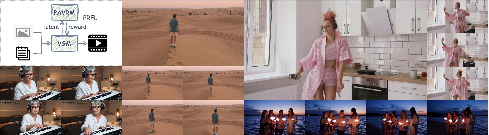
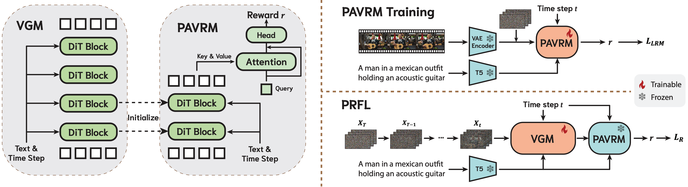
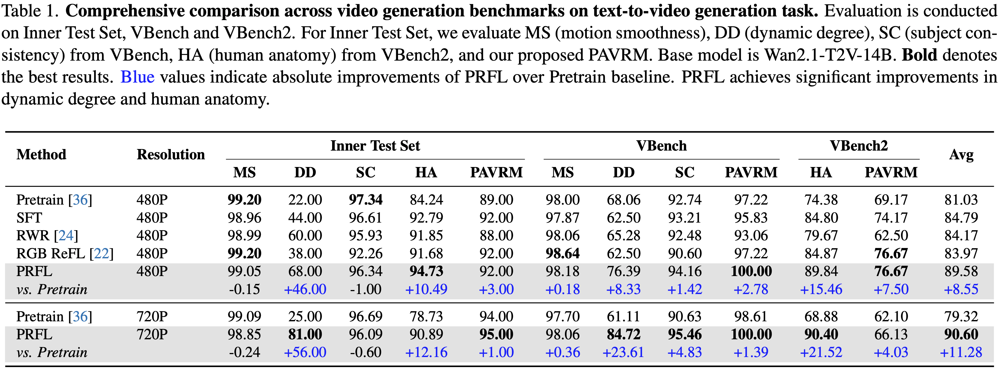
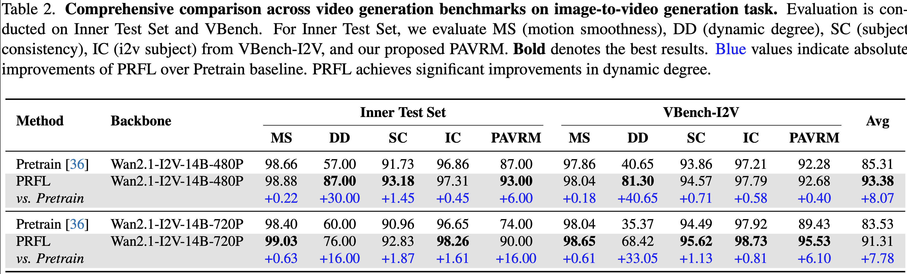
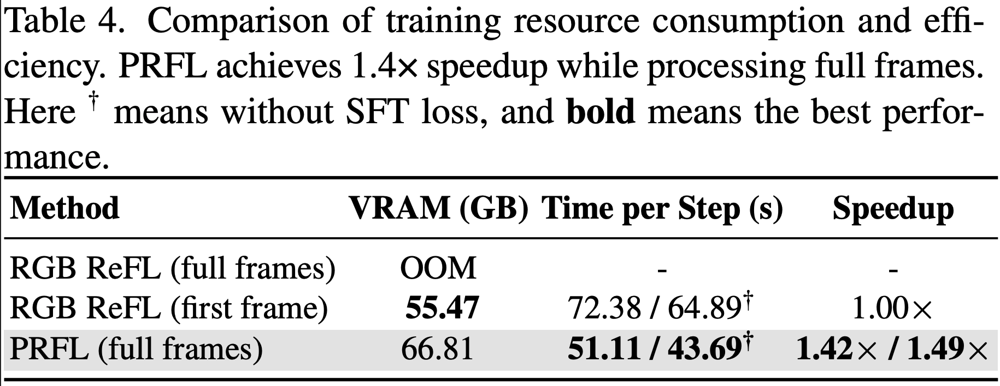

[中文文档](./README_CN.md)

# HY-Video-PRFL

<div align="center">
  

# ⚡ HY-Video-PRFL: Video Generation Models Are Good Latent Reward Models

</div>

Video generation models can both create and evaluate — we enable 14B models to complete full 720P×81-frame post-training within 67GB VRAM, achieving 1.5× faster speed and 56% improvement in motion quality over traditional methods.


<div align="center">
  <a href="https://github.com/Tencent/HY-Video-PRFL"></a> &ensp;
  <a href="https://hy-video-prfl.github.io/HY-VIDEO-PRFL/"></a> &ensp;
  <a href="https://arxiv.org/pdf/2511.21541"></a> &ensp;
</div>

<br>



> [**HY-Video-PRFL: Video Generation Models Are Good Latent Reward Models**](https://arxiv.org/pdf/2511.21541) <be>

## 🔥🔥🔥 News!!

* **Dec 07, 2025**: 👋 We release the training and inference code of HY-Video-PRFL.
* **Nov 26, 2025**: 👋 We release the paper and project page. [[Paper](https://arxiv.org/pdf/2511.21541)] [[Project Page](https://hy-video-prfl.github.io/HY-VIDEO-PRFL/)]
## 📑 Open-source Plan

- HY-Video-PRFL
  - [x] Training and inference code for PAVRM
  - [x] Training and inference code for PRFL
  
## 📋 Table of Contents

- [🔥🔥🔥 News!!](#-news)
- [📑 Open-source Plan](#-open-source-plan)
- [📖 Abstract](#-abstract)
- [🏗️ Model Architecture](#-model-architecture)
- [📊 Performance](#-performance)
- [🎬 Case Show](#-case-show)
- [📜 Requirements](#-requirements)
- [🛠️ Installation](#-installation)
- [🧱 Download Models](#-download-models)
- [🎓 Training](#-training)
- [🚀 Inference](#-inference)
- [📝 Citation](#-citation)
- [🙏 Acknowledgements](#-acknowledgements)


## 📖 Abstract

Reward feedback learning (ReFL) has proven effective for aligning image generation with human preferences. However, its extension to video generation faces significant challenges. Existing video reward models rely on vision-language models designed for pixel-space inputs, confining ReFL optimization to near-complete denoising steps after computationally expensive VAE decoding.

**HY-Video-PRFL** introduces **Process Reward Feedback Learning (PRFL)**, a framework that conducts preference optimization entirely in latent space. We demonstrate that pre-trained video generation models are naturally suited for reward modeling in the noisy latent space, enabling efficient gradient backpropagation throughout the full denoising chain without VAE decoding.

**Key advantages:**
- ✅ Efficient latent-space optimization
- ✅ Significant memory savings
- ✅ 1.4X faster training compared to RGB ReFL
- ✅ Better alignment with human preferences


## 🏗️ Model Architecture



**Traditional RGB ReFL** relies on vision-language models designed for pixel-space inputs, requiring expensive VAE decoding and confining optimization to late-stage denoising steps.

**Our PRFL approach** leverages pre-trained video generation models as reward models in the noisy latent space. This enables:
- Full-chain gradient backpropagation without VAE decoding
- Early-stage supervision for motion dynamics and structure coherence
- Substantial reductions in memory consumption and training time


## 📊 Performance

### Quantitative Results

Our experiments demonstrate that PRFL achieves substantial motion quality improvements (with +56.00 in dynamic degree, +21.52 in human anatomy and superior alignment with human preferences) as well as significant efficiency gains (with at least 1.4X faster training and notable memory savings).

#### Text-to-Video Results


#### Image-to-Video Results


#### Efficiency Comparison


## 🎬 Case Show

### Text-to-Video Generation

|480P Resolution|720P Resolution|
|---|---|
|<video src="https://github.com/user-attachments/assets/eed8d875-4b0d-43ec-b013-f0d10c2e107a" width="600" controls autoplay loop></video> <details><summary>📋 Show prompt</summary>```Two shirtless men with short dark hair are sparring in a dimly lit room. They are both wearing boxing gloves, one red and one black. One man is wearing white shorts while the other is wearing black shorts. There are several screens on the wall displaying images of buildings and people.```</details>|<video src="https://github.com/user-attachments/assets/4871a9f9-9b15-4065-8680-1c8059242707" width="600" controls autoplay loop></video> <details><summary>📋 Show prompt</summary>```A woman with fair skin, dark hair tied back, and wearing a light green t-shirt is visible against a gray background. She uses both hands to apply a white substance from below her eyes upward onto her face. Her mouth is slightly open as she spreads the cream.```</details>|
|<video src="https://github.com/user-attachments/assets/27296444-973b-4815-b103-5a2ee06404db" width="600" controls autoplay loop></video> <details><summary>📋 Show prompt</summary>```The woman has dark eyes and is holding a black smartphone to her ear with her right hand. She is typing on the keyboard of an open silver laptop computer with her left hand. Her fingers have blue nail polish. She is sitting in front of a window covered by sheer white curtains.```</details>|<video src="https://github.com/user-attachments/assets/430ff1ca-63ae-4a67-b6fb-b010c7ceec29" width="600" controls autoplay loop></video> <details><summary>📋 Show prompt</summary>```A light-skinned man with short hair wearing a yellow baseball cap, plaid shirt, and blue overalls stands in a field of sunflowers. He holds a cut sunflower head in his left hand and touches it with his right index finger. Several other sunflowers are visible in the background, some facing away from the camera.```</details>|

### Image-to-Video Generation

|480P Resolution|720P Resolution|
|---|---|
| <video src="https://github.com/user-attachments/assets/956f5f64-1680-45a0-8666-9fda8e253017" width="600" controls autoplay loop></video> <details><summary>📋 Show prompt</summary>```A monochromatic video capturing a cat's gaze into the camera```</details>| <video src="https://github.com/user-attachments/assets/8dfeb1ae-8b9c-45aa-899a-3b48903629f9" width="600" controls autoplay loop></video> <details><summary>📋 Show prompt</summary>```A young boy is jumping in the mud```</details>|
| <video src="https://github.com/user-attachments/assets/092e182a-3c69-4b3c-a23a-e0d480d77b2f" width="600" controls autoplay loop></video> <details><summary>📋 Show prompt</summary>```A family of four eats fast food at a table.```</details>| <video src="https://github.com/user-attachments/assets/95a370a6-03ef-476f-8d98-a4aeb08ba242" width="600" controls autoplay loop></video> <details><summary>📋 Show prompt</summary>```Normal speed, Medium shot, Eye level angle, Third person viewpoint, Static camera movement, Frame-within-frame composition, Shallow depth of field, Natural light, Cinematic style, Desaturated palette with slate blue, dusty rose, and dark wood tones color palette, Dramatic atmosphere. The scene is set on a patio or veranda, framed by a stone archway. In the back, there is a large, weathered wooden gate set into a stone wall. Six people are gathered on a stone patio in front of a large wooden gate. On the right, two men are seated at a dark wooden table. An older man in a grey traditional jacket holds a cane and gestures with his right hand while speaking. A younger man in a light grey suit sits beside him, listening. On the left side of the frame, a man in a dark suit stands with his back to the camera. Next to him, a woman in a pink patterned cheongsam and a woman in a grey skirt suit are standing close together, whispering. The women then turn and smile towards the men at the table. The man in the dark suit turns to face the group, revealing a newborn baby cradled in his arms, wrapped in a pink blanket. He takes a few steps forward, holding the baby. The women look at him and the infant. The older man at the table continues to talk, now gesturing towards the man with the baby. The man holding the baby looks down at the infant as he continues to walk slowly. The table is set with white cups, plates, fruit, and a dark wooden box.```</details>|

## 📜 Requirements

### Hardware Requirements

We recommend using  GPUs with at least 80GB of memory for better generation quality.

### Software Requirements

* **OS**: Linux
* **CUDA**: 12.4

## 🛠️ Installation

### Step 1: Clone Repository
```bash
git clone https://github.com/Tencent-Hunyuan/HY-Video-PRFL.git
cd HY-Video-PRFL
```

### Step 2: Setup Environment

We recommend CUDA versions 12.4 for installation. Conda's installation instructions are available [here](https://www.anaconda.com/docs/main).
```bash
# Create conda environment
conda create -n HY-Video-PRFL python==3.10

# Activate environment
conda activate HY-Video-PRFL

# Install PyTorch and dependencies (CUDA 12.4)
pip3 install torch==2.5.0 torchvision==0.20.0 torchaudio==2.5.0 --index-url https://download.pytorch.org/whl/cu121

# Install additional dependencies
pip3 install git+https://github.com/huggingface/transformers qwen-vl-utils[decord]
pip3 install git+https://github.com/huggingface/diffusers
pip3 install xfuser -i https://pypi.org/simple
pip3 install flash-attn==2.5.0 --no-build-isolation
pip3 install -e .
pip3 install nvidia-cublas-cu12==12.4.5.8

export PYTHONPATH=./
```

## 🧱 Download Models

Download the pretrained models before training or inference:

| Model | Resolution | Download Links | Notes |
|-------|-----------|----------------|-------|
| **Wan2.1-T2V-14B** | 480P & 720P | 🤗 [Huggingface](https://huggingface.co/Wan-AI/Wan2.1-T2V-14B) <br> 🤖 [ModelScope](https://www.modelscope.cn/models/Wan-AI/Wan2.1-T2V-14B) | Text-to-Video model |
| **Wan2.1-I2V-14B-720P** | 720P | 🤗 [Huggingface](https://huggingface.co/Wan-AI/Wan2.1-I2V-14B-720P) <br> 🤖 [ModelScope](https://www.modelscope.cn/models/Wan-AI/Wan2.1-I2V-14B-720P) | Image-to-Video (High-res) |
| **Wan2.1-I2V-14B-480P** | 480P | 🤗 [Huggingface](https://huggingface.co/Wan-AI/Wan2.1-I2V-14B-480P) <br> 🤖 [ModelScope](https://www.modelscope.cn/models/Wan-AI/Wan2.1-I2V-14B-480P) | Image-to-Video (Standard) |

First, make sure you have installed the huggingface CLI or modelscope CLI.
```
pip install -U "huggingface_hub[cli]"
pip install modelscope
```
Then, download the pretrained DiT and VAE checkpoints. For example, you can use the following command to download the WAN2.1 checkpoint of 720P I2V task to ```./weights``` by default.
```
hf download Wan-AI/Wan2.1-I2V-14B-720P --local-dir ./weights
```

## 🎓 Training

### 1️⃣ Data Preprocess on single GPU
```bash
python3 scripts/preprocess/gen_wanx_latent.py --config configs/pre_480.yaml
```

We provide several videos in ```temp_data/videos``` as template training data and an input json file ```temp_data/temp_input_data.json```template for preprocess. ```configs/pre_480.yaml``` is for 480P latent extraction and ```configs/pre_720.yaml``` is for 720P. The ```json_path``` and ```save_dir``` in config file can be customized with your own training data.

### 2️⃣ Data Annotation and Format Conversion

The annotation for reward model (e.g. ```"physics_quality": 1, "human_quality": 1```) should be added in the data meta files (e.g. ```temp_data/480/meta_v1/0004e625d5bcb80130e1ea3d204e2488_meta_v1.json```). Thus we get meta file list ```temp_data/temp_data_480.list``` and ```temp_data/temp_data_720.list``` which can be used in PAVRM and PRFL training.

### 3️⃣ Parallel PAVRM Training on Multiple GPUs

For example, to train PAVRM with 8 GPUs, you can use the following command.

```bash
torchrun --nnodes=1 --nproc_per_node=8 --master_port 29500 scripts/pavrm/train_pavrm.py --config configs/train_pavrm_i2v_720.yaml
```

The ```meta_file_list``` and ```val_meta_file_list``` in config file can be customized with your own training and validation data. We provide several config files for different settings t2v or i2v, 480P or 720P. To be noted that, we train PAVRM with ce loss. To train PAVRM with bt loss, you can use the config file of ```configs/train_pavrm_bt_i2v_720.yaml```.

### 4️⃣ Parallel PRFL Training on Multiple GPUs

```bash
torchrun --nnodes=1 --nproc_per_node=8 --master_port 29500 scripts/prfl/train_prfl.py --config configs/train_prfl_i2v_720.yaml
```

The ```meta_file_list``` in config file can be customized with your own training data, ```lrm_transformer_path```, ```lrm_mlp_path``` and ```lrm_query_attention_path``` in config file are for your reward model obtained from the previous step. We provide several config files for different settings t2v or i2v, 480P or 720P.


## 🚀 Inference

### 1️⃣ Parallel PAVRM Inference on Multiple GPUs

```bash
torchrun --nnodes=1 --nproc_per_node=8 --master_port 29500 scripts/pavrm/inference_pavrm.py --config configs/infer_pavrm_i2v_720.yaml
```

The ```val_meta_file_list``` in config file can be customized with your own inference data, ```resume_transformer_path```, ```resume_mlp_path``` and ```resume_query_attention_path``` in config file are for your reward model to be tested.

### 2️⃣ Parallel PRFL Inference on Multiple GPUs

The PRFL Inference is exactly same as its base model (e.g. Wan2.1).

```bash
export negative_prompt="色调艳丽，过曝，静态，细节模糊不清，字幕，风格，作品，画作，画面，静止，整体发灰，最差质量，低质量，JPEG压缩残留，丑陋的，残缺的，多余的手指，画得不好的手部，画得不好的脸部，畸形的，毁容的，形态畸形的肢体，手指融合，静止不动的画面，杂乱的背景，三条腿，背景人很多，倒着走"
torchrun --nnodes=1 --nproc_per_node=8 --master_port 29500 scripts/prfl/inference_prfl.py \
    --dit_fsdp \
    --t5_fsdp \
    --ulysses_size 1 \
    --task "i2v-14B"\
    --ckpt_dir "weights/Wan2.1-I2V-14B-720P" \
    --lora_path "" \
    --lora_alpha 0 \
    --dataset_path "temp_data/temp_prfl_infer_data.json" \
    --negative_prompt "$negative_prompt" \
    --size "1280*720" \
    --frame_num 81 \
    --sample_steps 40 \
    --sample_guide_scale 5.0 \
    --sample_shift 5.0 \
    --teacache_thresh 0 \
    --save_folder outputs/infer/prfl_i2v_720 \
    --transformer_path <YOUR_CKPT_PATH> \
    --offload_model False
```

**Parameters:**
- `--dit_fsdp` `--t5_fsdp`: Enable FSDP for memory efficiency
- `--task`: "t2v-14B" or "i2v-14B"
- `--ckpt_dir`: Path to pretrained checkpoint file
- `--lora_path` `--lora_alpha`: Path and load weight ratio for LoRA checkpoint file
- `--dataset_path`: Path to inference dataset file
- `--size`: Output resolution ("1280\*720" or "832\*480")
- `--frame_num`: Number of frames to generate (default: 81)
- `--sample_steps`: Number of inference steps (default: 40)
- `--sample_guide_scale`: Classifier-free guidance scale (default: 5.0)
- `--sample_shift`: Flow shift (default: 5.0)
- `--save_folder`: Path to save generated videos
- `--teacache_thresh`: Enable teacache
- `--transformer_path`: Path to your PRFL checkpoint file
- `--offload_model`: Offload to CPU to save GPU memory

## 📝 Citation

If you find **HY-Video-PRFL** useful for your research, please cite:
```bibtex
@article{mi2025video,
  title={Video Generation Models are Good Latent Reward Models},
  author={Mi, Xiaoyue and Yu, Wenqing and Lian, Jiesong and Jie, Shibo and Zhong, Ruizhe and Liu, Zijun and Zhang, Guozhen and Zhou, Zixiang and Xu, Zhiyong and Zhou, Yuan and Lu, Qinglin and Tang, Fan},
  journal={arXiv preprint arXiv:2511.21541},
  year={2025}
}
```


## 🙏 Acknowledgements

We sincerely thank the contributors to the following projects:
- [HunyuanVideo](https://github.com/Tencent/HunyuanVideo)
- [Wan2.1](https://github.com/Wan-Video/Wan2.1)
- [ImageReward](https://github.com/THUDM/ImageReward)
- [Diffusers](https://github.com/huggingface/diffusers)
- [HuggingFace](https://huggingface.co)
- [DeepSpeed](https://github.com/deepspeedai/DeepSpeed)


---

<div align="center">
  
**Star ⭐ this repo if you find it helpful!**

</div>
